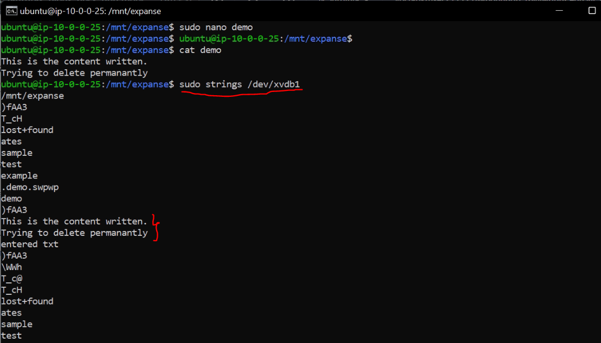
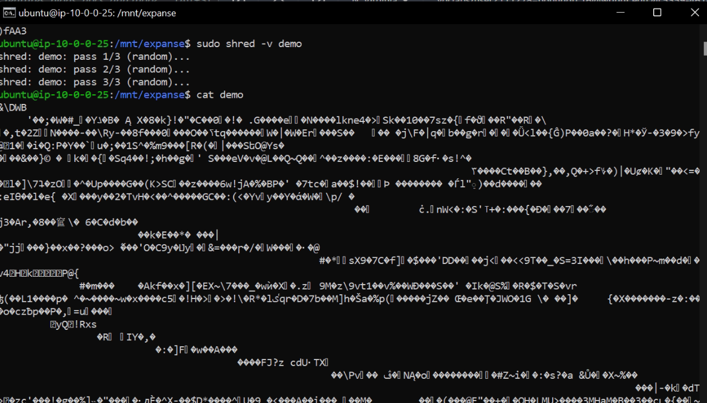
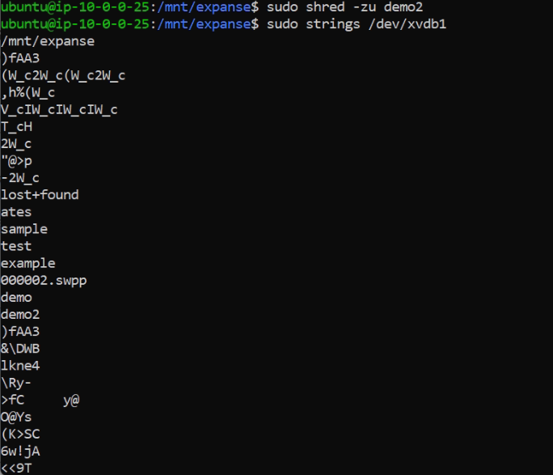
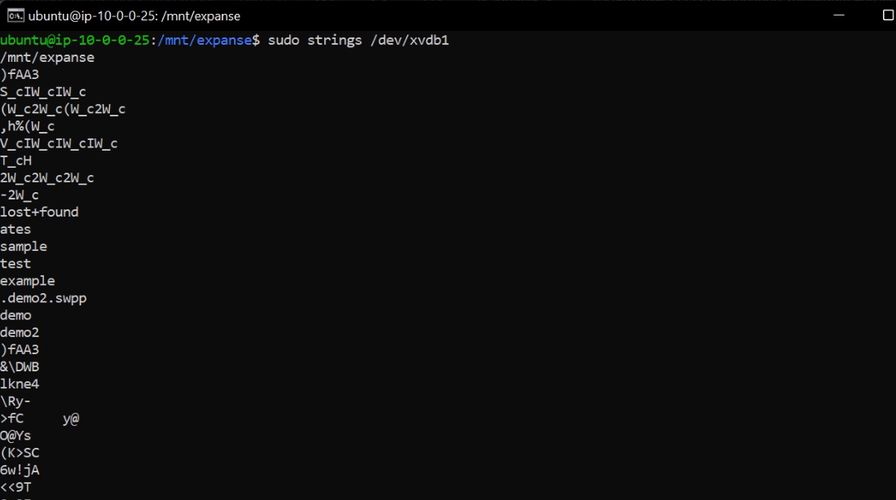

## Lab 08

- Name:
- Email

## Part 1 Answers

1. Currently `xvda1` parition of `xvda` disk is mounted to root `/`, it's of `ext4` and is of 16GB size 
    - `df -h` lists mounted blocks, `lsblk -l` displays all about block devices.
2. Yes, there is `xvdb` of size 4 GB which is unmouted, so total there are 2 drives `xvda, xvdb`.
3. `gdisk` main menu options
   - `p` - `print the partition table`
   - `o` - `create a new empty GUID partition table (GPT)`
   - `n` - `add a new partition`
   - `i` - `show detailed information on a partition`
   - `w` - `write table to disk and exit`
4. Using the `gdisk` utility on the disk: DONE. Used `sudo gdisk /dev/xvdb` followed by `n` and created 1 GB Linux filesystem paritition.
5. `sudo mkfs.ext4 /dev/xvdb1` - Makes ext4 on new parition. To verify `lsblk -l`
6. `sudo mkdir /mnt/expanse` - creates `expanse` in `/mnt`.
7. `sudo mount /dev/xvdb1 /mnt/expanse` - Creates mount point to `/mnt/expanse`. To verify: `df -h`
8. `cd expanse` - get into mount dir. `sudo mkdir x y` - Created two directories. `sudo nano test` entered some text and saved.
9. Used `sudo strings /dev/xvdb1`. It gives the files created and the content which is inside the files as well. It lists in format such that lists all files names followed by each file and contents of it and list of files at the end.
10. On deleting and checking, still we can see the files which existed and the contents inside it. I did this multiple times and can find all the previously created files and it's content as well. Used `sudo strings /dev/xvdb1`.
11. We can use various commands like `shred` , `wipe`, `secure-delete`. 
  - I have used `shred` and did as delete the file.
  - Steps involved: 
   - create a file with some content. `sudo nano demo` and enter some text, save and exit
   - Check `sudo strings /dev/xvdb1`
   - Here is the screenshot of above work:
      - 
   - Once check content using `cat demo`. Now use `sudo shred -v demo` and then `cat demo`. 
   - We can see text overwritten 3 times(default) and is completely in unreadble format.
   - Here is the screenshot of above work:
      - 
   - Now to delete `sudo rm demo` can be used.
   - I have created demo2 and applied `sudo shred -zu demo2`. Here is the work
   - The best way is `sudo shred -zu demo2` - this overwrites the content 3 times(default)(can use -n 5 to make 5 times), replaces final pass with zeros to hide shredding(-z) and then removes the file(-u).
      - 
   - Now perform `sudo strings /dev/xvdb1` and no traces of data can be found.
   - After deleting, if we try to see the content using `strings`, it is as follows:
      - 
12. `sudo umount /dev/xvdb1`. No, files and folders cannot be accessed as the disk is removed. `expanse` is now empty. To view content, just mount it to any directory and get into it, we can see the files, folders.

## Part 2 Answers

1. Steps: `cd Lab08`, `nano original.txt` and entered some text into it.
2. For `original.txt` identify:
   - Command to find the following info about `original.txt`: `stat original.txt`
   - inode number of `original.txt`: `513512`
   - number of blocks storing `original.txt`: `8`
   - number of links to `original.txt`: `1`
3. Command to create a hard link to `original.txt`: `ln original.txt hardLink`
   - What identifiers indicate a hard link was created? : 
      - `ls -i` gives inode numbers followed by filenames. So here if two files have same inode numbers then there is a hardlink between them. Also using `stat <filename>`, we can find the size, inode of the files.
   - Does modifying the hard linked file modify `original.txt`? Explain
      - Yes, it modifies original file as well.
      - Any change made to either of the file's content, will result changes in both. Size changes.
      - As `inode` value is same, it points to same location, whenever there is change in content it reflects in both files.
      - Even though if name of the original file is changed, moved to different path or even if `original.txt` is deleted, the hardLink file has no changes, we can still access it and read the contents of it.
4. Command to create a symbolic link to `original.txt` : `ln -s original.txt softLink`
   - What identifiers indicate a symbolic link was created? : 
      - `ls -l`, lists all details of files. Here clearly we can see `l` as part of file permissions. `lrwxrwxrwx`, so the starting `l`,represents it is softlink file. Also there is a link showing like: `softLink -> original.txt`. Which means, `softLink` is a file which has link to `original.txt`.
      - Both have different inode values, different sizes, blocks. (can be seen using `stat` command)
   - If `original.txt` was deleted, and a new `original.txt` was created, would the sym link still work? Explain
      - Yes, the symbolic link still works fine. On deleting the file and creating new file with same name, symbolic link has no effect.
      - Unlike hardlink, softlinks don't work if the original file name is changed.
      - Even if we rename the original filename, it leads to dangling link and we cannot read anything with the sym link file.
      - Only way is to rename the changed file or just delete the file and create a new file followed by creation of new sym link.
5. Command to create a copy of `original.txt` : `cp original.txt original_copy.txt` (cp is used to copy file). `cat original.txt >> copy` also works.
   - Does modifying the copied file modify `original.txt`? Explain
      - No, modifying a copied files, does zero impact to the original file.
      - There is no relation between two files, both have different inode numbers and changing content results to different sizes.
      - We are just creating a new file with contents of existing file and having no link to one another.
6. Command to move `original.txt` to another directory. : `mv original.txt ~/sample/`
   - Does it have the same inode? Explain : Yes, it has same inode number, size, blocks.
   - Was the hard link you created affected? Explain
      - No, it is no affected. Though the file is moved, it has same inode value and as hardlink points to same inode value, no matter what the file name or path is. There is no affect to the hardLink file.
   - Was the symbolic link you created affected? Explain
      - Yes, there is an affect. As the file is not in the expected path, the symbolic link resulted to dangling link.
      - It has same inode as softlink before but the pointer file `original.txt` is not existing in same path.
      - To make it work, we need to create a file with `original.txt` or just bring back the moved file.

## Extra Credit Answers

1. Make a backup of the current version of `/etc/fstab`: 
   - Created a back up file of /etc/fstab: `cp /etc/fstab ~/fstab.backup`
2. Add your partition and the mount point (`/mnt/expanse`) to `/etc/fstab`
   - Line added to `/etc/fstab`: `/dev/xvdb1       /mnt/expanse    ext4    defaults        0 0`
3. I did `sudo mount -a` and then `df` and I found my parition is successfully mounted to the `/mnt/expanse` and I can see my files which are created previously.
   - I used `ls /mnt/expanse` and all the files which I created previously as part of `Part 1` are listed.
   - My line which is added to `/etc/fstab` completely works fine and mounting is successful.
4. I didn't reboot it, as that might effect my vm for further works. I'm not confident to go ahead with it.
5. I have reset all the changes to fstab and everything is clear now.